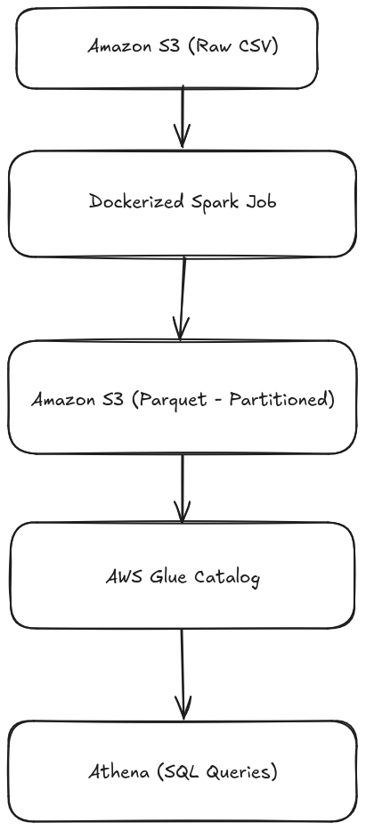

# AWS Batch Data Pipeline using PySpark


**Status:** Fully functional and tested using Amazon Athena queries.

---

## Overview

This project implements a production-style batch data pipeline on AWS.  
It ingests transactional CSV data, validates and transforms it using PySpark, writes optimized partitioned Parquet files to Amazon S3, and exposes the dataset for analytics using AWS Glue Data Catalog and Amazon Athena.

The system is designed with schema enforcement, partition optimization, and Athena compatibility in mind.

---

## Architecture



---

## AWS Services Used

- Amazon S3 – Data lake storage  
- AWS Glue Data Catalog – Metadata management  
- Amazon Athena – Serverless SQL querying  

---

## Tech Stack

- Python  
- PySpark  
- Parquet  
- YAML Configuration  
- Structured Logging  

---

## Project Structure

```bash
batch-pipeline
├── config
│   └── config.yaml
├── data
│   └── input
│       └── orders.csv
├── Dockerfile
├── docs
│   └── architecture.png
├── main.py
├── Makefile
├── readme.md
├── requirements.txt
├── spark
│   ├── __pycache__
│   │   └── spark_session.cpython-310.pyc
│   └── spark_session.py
├── sql
│   └── athena_queries.sql
├── src
│   ├── ingest.py
│   ├── load.py
│   ├── __pycache__
│   │   ├── ingest.cpython-310.pyc
│   │   ├── load.cpython-310.pyc
│   │   ├── transform.cpython-310.pyc
│   │   └── validate.cpython-310.pyc
│   ├── transform.py
│   ├── utils
│   │   ├── logger.py
│   │   ├── __pycache__
│   │   └── retry.py
│   └── validate.py
└── structure.txt
```

## Key Engineering Decisions

- **Parquet format** for columnar storage and improved Athena performance  
- **Partitioning by `order_date`** to reduce Athena scan cost  
- **Explicit schema casting** to prevent Spark–Athena type mismatches  
- **Glue Catalog integration** for external table management  
- **Idempotent partition overwrite** for safe pipeline re-runs  

---

## Data Flow

1. Read raw CSV data  
2. Apply validation rules and type casting  
3. Write partitioned Parquet files to S3  
4. Sync partitions with Glue Catalog  
5. Query data using Athena  

---

## Sample Query (Athena)

```sql
SELECT country, SUM(amount) AS total_amount
FROM orders_cleaned
GROUP BY country;
```

---

## How to Run

1. Build Docker Image

```bash
docker build -t spark-batch-pipeline .
```

2. Run Container

```bash
docker run -v ~/.aws:/root/.aws spark-batch-pipeline
```

## Alternative: Run Without Docker
Execute:

```bash
python main.py
```

---

## Production Considerations

- Handles schema mismatches between Spark and Athena  
- Prevents malformed Parquet writes  
- Optimized for Athena scan efficiency  
- Designed for scalable batch ingestion  

---

## What This Project Demonstrates

- Real-world batch data engineering architecture
- Spark + S3 cloud integration
- Metadata-driven analytics via Glue
- Athena-ready dataset optimization
- Production-style pipeline structuring

---

## Roadmap

- [x] Airflow DAG for end-to-end pipeline orchestration
- [ ] Data quality checks using Great Expectations
- [ ] CI/CD integration with GitHub Actions
- [ ] CloudWatch monitoring and alerting

---

## Author

- **Subhajoy Ghosh**
- AWS Certified Developer – Associate
- Associate @ PwC

---
